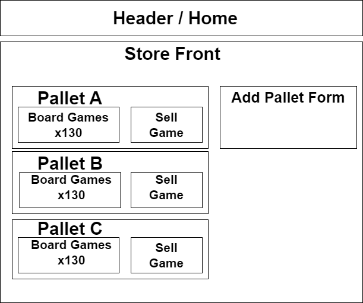

# Game Store Inventory Tracker

# Component Structure:

## Description:
A code review for Epicodus React Fundamentals unit. This is a virtual storefront/inventory tracker for a board game store.
* Users can choose to add a pallet of one of three diffrent board game genres to the store inventory.
* Each pallet contains 130 units, which can be decremented by navigating to a given board game pallet's detail page.
* All items can be seen from the main list component, and each genre has a page that can be navigated to which filters the main list down to one genre.
* To add a new Pallet, navigate to the "Add Pallet Form", and select the button that says "Order new Pallet." This will reset the genre option. Otherwise it will default to "Puzzle."

## Pages/Views/States:
* "Order Pallet Form" is the starting point. If a user advances with "Choose Genre" without a genre selected, the form will default to "Puzzle". "Return to Available Games" button will show the list of games currently in the inventory, if any. "See games by category:" will advance users through three screens, filtering the inventory by genre, if games are available.
* "Add Pallet Form" is the secondary form to "Order Pallet" which prompts users to enter a game name and price. The fields are required, so a user is unable to "Add Pallet of Games" without filling out these fields. The Game Genre and Quantity are locked, with the Genre being determined by the selection on the Order form, and 130 being the required example quantity.
* "Available Games List" displays all games currently in the inventory. "Return to Order Form" will return the user to the "Add Pallet Form" view. The "See games by category:" button is also here with the same functionality. Each game has a "Sell Games" button that will first take the user to the game details page, where another sell button will take them to the actual form. It's a little clunky, but I think it's fine as an intuititve because it's unclear that clicking the div where the game lives will take them to details anyway.
* "Pallet Detail" shows the games in the pallet's title, price, and quantity. There are buttons to delete the pallet and to sell games from the pallet.
* "Sell Game" shows the title of the game, price, genre and prompts the user to enter an amount of games to sell. The user cannot exceed the remainder of games this way by means of a required field.

# Getting Started with Create React App

This project was bootstrapped with [Create React App](https://github.com/facebook/create-react-app).

## Available Scripts

In the project directory, you can run:

### `npm start`

Runs the app in the development mode.\
Open [http://localhost:3000](http://localhost:3000) to view it in your browser.

The page will reload when you make changes.\
You may also see any lint errors in the console.

### `npm test`

Launches the test runner in the interactive watch mode.\
See the section about [running tests](https://facebook.github.io/create-react-app/docs/running-tests) for more information.

### `npm run build`

Builds the app for production to the `build` folder.\
It correctly bundles React in production mode and optimizes the build for the best performance.

The build is minified and the filenames include the hashes.\
Your app is ready to be deployed!

See the section about [deployment](https://facebook.github.io/create-react-app/docs/deployment) for more information.

### `npm run eject`

**Note: this is a one-way operation. Once you `eject`, you can't go back!**

If you aren't satisfied with the build tool and configuration choices, you can `eject` at any time. This command will remove the single build dependency from your project.

Instead, it will copy all the configuration files and the transitive dependencies (webpack, Babel, ESLint, etc) right into your project so you have full control over them. All of the commands except `eject` will still work, but they will point to the copied scripts so you can tweak them. At this point you're on your own.

You don't have to ever use `eject`. The curated feature set is suitable for small and middle deployments, and you shouldn't feel obligated to use this feature. However we understand that this tool wouldn't be useful if you couldn't customize it when you are ready for it.

## Learn More

You can learn more in the [Create React App documentation](https://facebook.github.io/create-react-app/docs/getting-started).

To learn React, check out the [React documentation](https://reactjs.org/).

### Code Splitting

This section has moved here: [https://facebook.github.io/create-react-app/docs/code-splitting](https://facebook.github.io/create-react-app/docs/code-splitting)

### Analyzing the Bundle Size

This section has moved here: [https://facebook.github.io/create-react-app/docs/analyzing-the-bundle-size](https://facebook.github.io/create-react-app/docs/analyzing-the-bundle-size)

### Making a Progressive Web App

This section has moved here: [https://facebook.github.io/create-react-app/docs/making-a-progressive-web-app](https://facebook.github.io/create-react-app/docs/making-a-progressive-web-app)

### Advanced Configuration

This section has moved here: [https://facebook.github.io/create-react-app/docs/advanced-configuration](https://facebook.github.io/create-react-app/docs/advanced-configuration)

### Deployment

This section has moved here: [https://facebook.github.io/create-react-app/docs/deployment](https://facebook.github.io/create-react-app/docs/deployment)

### `npm run build` fails to minify

This section has moved here: [https://facebook.github.io/create-react-app/docs/troubleshooting#npm-run-build-fails-to-minify](https://facebook.github.io/create-react-app/docs/troubleshooting#npm-run-build-fails-to-minify)

### License:
MIT License
Copyright (c) 2023 Thomas McDowell
